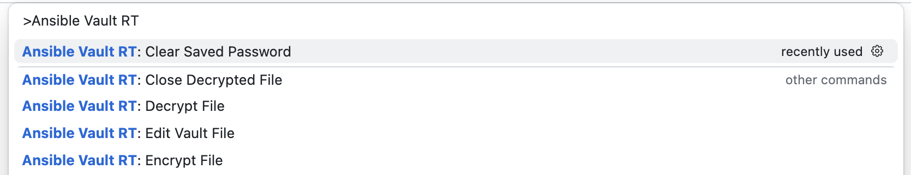
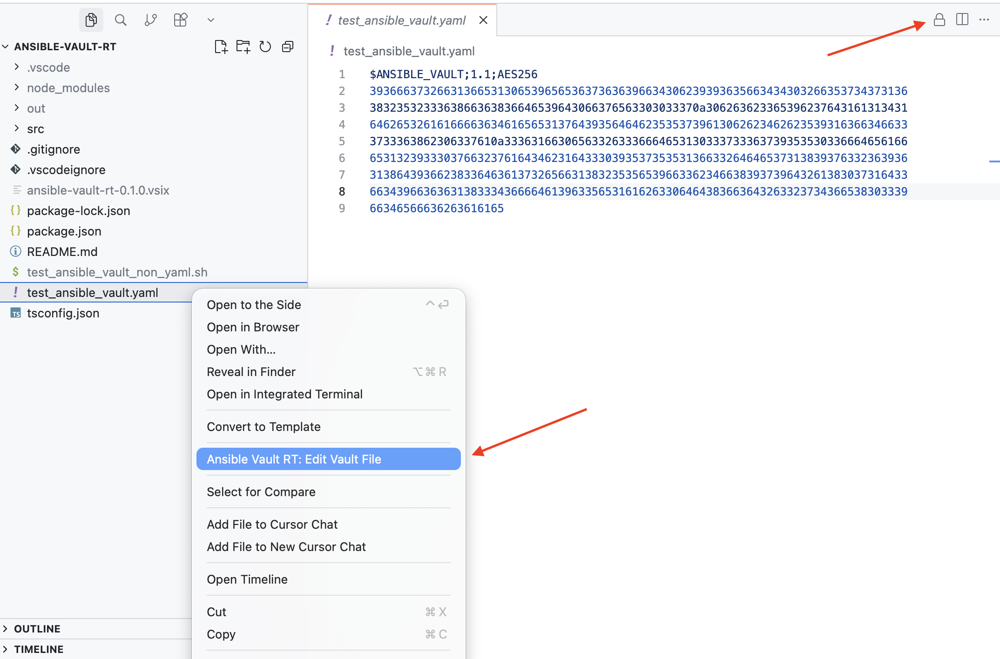
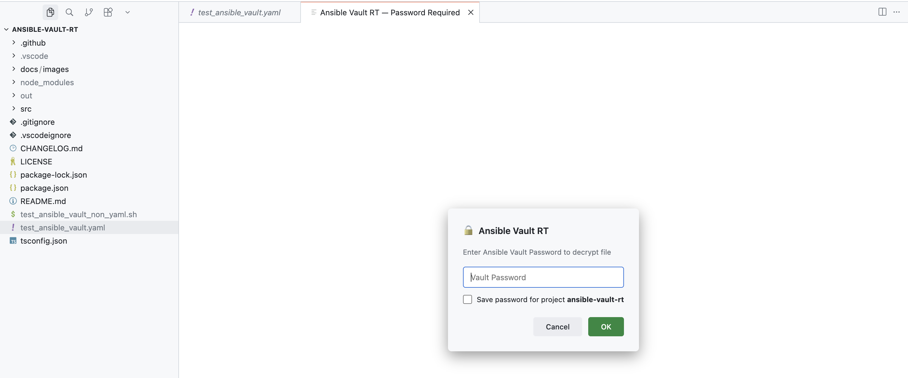

# Ansible Vault RT (Real-Time Editing)

A VS Code / Antigravity IDE / Cursor extension for real-time decryption, in-editor modification, and re-encryption of Ansible Vault files.

## Features

- 🔐 **Real-Time In-Editor Editing**: Open encrypted Ansible Vault files in VS Code, modify them in-memory, and automatically re-encrypt on save (`Cmd+S` / `Ctrl+S`).
- 📁 **Universal File Format Support**: Works on **any** file type (YAML, Shell scripts, JSON, `.env`, INI, Python, XML, SSH keys, or extensionless secret files).
- 🔑 **Per-Project Encrypted Password Persistence**:
  - Securely saves passwords per project/workspace.
  - Encrypted natively in your OS Keychain (macOS Keychain, Windows Credential Manager, Linux Keyring) via `SecretStorage` API.
  - Automatically decrypts vault files without password prompts once saved.
- 🛠️ **Seamless Error Recovery**:
  - Prompts to update or delete saved passwords if the stored password becomes invalid.
- ⚡ **Multi-Location Menu Integration**: Easily trigger vault editing from editor title bar buttons, editor context menus, File Explorer context menus, or Command Palette.
- 🔒 **One-Click Encrypt / Decrypt In Place**: Right-click any file to encrypt it, or any Vault file to decrypt it, directly on disk (no need to open it first).

---

## Commands

| Command | Description | Shortcut / Menu Location |
| :--- | :--- | :--- |
| `ansible-vault-rt.editVaultFile` | **Ansible Vault RT: Edit Vault File** Decrypts and opens the file in a virtual editor tab (or prompts to encrypt plaintext files). | • Editor Title bar (`🔒` icon) • Editor Context Menu • File Explorer Context Menu • Command Palette (`Cmd+Shift+P`) |
| `ansible-vault-rt.closeDecryptedFile` | **Ansible Vault RT: Close Decrypted File** Closes decrypted virtual view and returns to the raw encrypted file on disk. | • Editor Title bar (`🔓` open lock icon when viewing decrypted tab) • Command Palette (`Cmd+Shift+P`) |
| `ansible-vault-rt.clearSavedPassword` | **Ansible Vault RT: Clear Saved Password** Deletes the saved password for the current project from OS Keychain. | • Command Palette (`Cmd+Shift+P`) |
| `ansible-vault-rt.encryptFile` | **Ansible Vault RT: Encrypt File** Encrypts any plaintext file in place on disk with Ansible Vault, after a confirmation prompt. | • Editor Context Menu • File Explorer Context Menu • Command Palette (`Cmd+Shift+P`) |
| `ansible-vault-rt.decryptFile` | **Ansible Vault RT: Decrypt File** Decrypts a Vault file in place on disk, permanently removing the encryption, after a confirmation prompt. | • Editor Context Menu • File Explorer Context Menu • Command Palette (`Cmd+Shift+P`) |

---

## How It Works

### 1. Opening an Encrypted Vault File
1. Click the `🔒` icon in the top right editor title bar (or right-click file in File Explorer and select **Ansible Vault RT: Edit Vault File**).

2. If a password is saved for the current project, the file opens **instantly**.
3. If no password is saved, you will be prompted to enter the Vault password.
4. After decryption, you will be asked if you want to save the password for the current project.

### 2. Saving Changes
- Edit the decrypted file in the virtual tab.
- Press `Cmd+S` (or `Ctrl+S`).
- The extension automatically re-encrypts the file using Ansible Vault and writes it back to disk.

### 3. Clearing / Updating Saved Passwords
- **To delete a saved password**: Open Command Palette (`Cmd+Shift+P`) and execute `Ansible Vault RT: Clear Saved Password`.
- **If a saved password fails**: A dialog will prompt you to either `"Enter New Password"` (to update/overwrite) or `"Delete Saved Password"`.

### 4. Encrypting / Decrypting a File In Place
Unlike **Edit Vault File** (which keeps the file encrypted on disk and only decrypts it into a virtual tab), **Encrypt File** / **Decrypt File** permanently change the file on disk:

1. Right-click a plaintext file and select **Ansible Vault RT: Encrypt File** (or a Vault file and select **Ansible Vault RT: Decrypt File**).
2. Confirm the action in the warning dialog.
3. If a password is already saved for the project, it's reused automatically (you'll be notified). Otherwise you'll be prompted for one, with the option to save it.
4. The file is encrypted/decrypted and overwritten on disk.

---

## Installation (.vsix)

1. Download the latest `.vsix` from [GitHub Releases](https://github.com/pitachx/ansible-vault-rt/releases).
2. Open VS Code / Antigravity IDE / Cursor.
3. Open Extensions view (`Cmd+Shift+X`).
4. Click the `...` menu in the top right of Extensions view and select **Install from VSIX...**.
5. Select the downloaded `ansible-vault-rt-X.Y.Z.vsix`.
